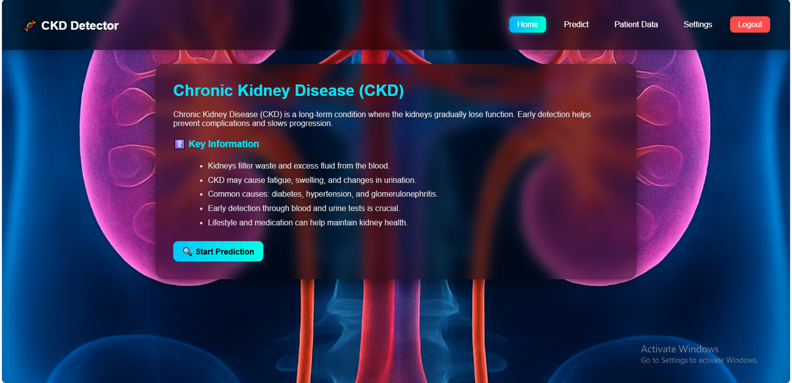
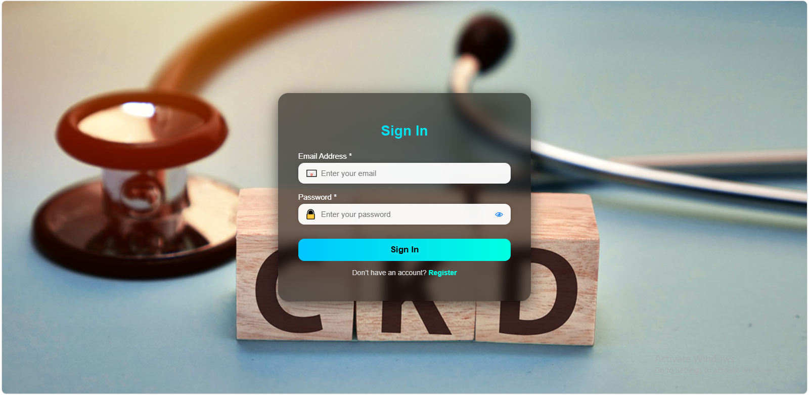
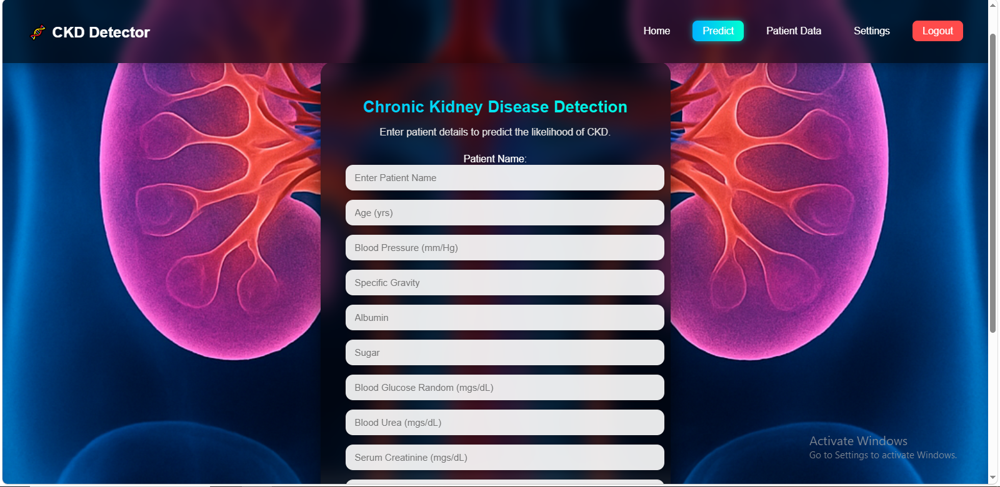
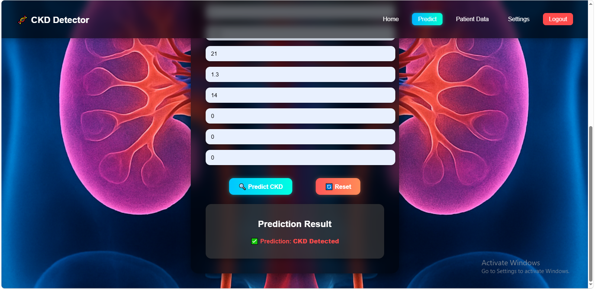
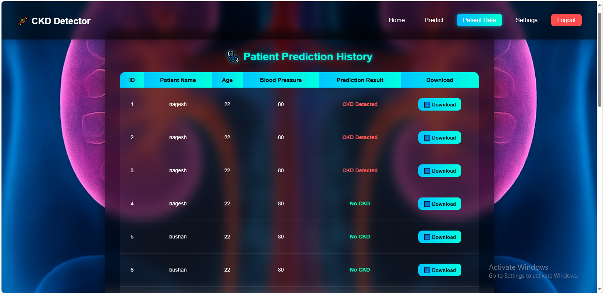
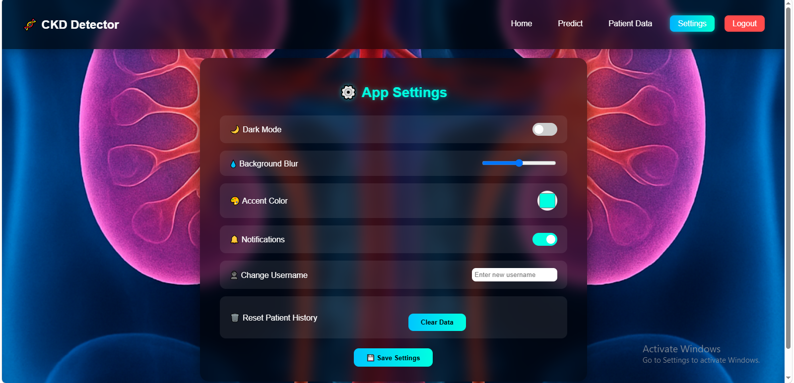

# 🩺 CKD Prediction Web App

## 📊 Project Overview

The **CKD Prediction Web App** is a Machine Learning-based web application developed to predict the possibility of **Chronic Kidney Disease (CKD)** based on selected clinical parameters.

The project combines **Machine Learning, Python, Flask, SQLite, SQLAlchemy, HTML, CSS, JavaScript, and PDF reporting** into an end-to-end web application.

The application allows users to enter clinical information, send the data to a trained Machine Learning model, generate a CKD prediction, store patient records, and generate a PDF report.

The project follows an end-to-end workflow:

**Clinical Data → Data Preprocessing → Machine Learning Model → Flask Application → Prediction → Patient Record → PDF Report**

> **Note:** This project is developed for educational and demonstration purposes. It is not intended to provide medical diagnosis or replace professional medical advice.


---

## 🎯 Problem Statement

Chronic Kidney Disease is a serious health condition that requires early identification and appropriate medical evaluation.

The objective of this project is to demonstrate how Machine Learning can be integrated into a web application to analyze selected clinical parameters and generate a prediction result.

The application aims to:

- Collect clinical parameters from users
- Prepare input data for the Machine Learning model
- Predict the possibility of CKD
- Display the prediction result
- Store patient records
- Allow users to view patient records
- Generate PDF reports
- Demonstrate integration between Machine Learning and a Flask web application

### Main Project Question

> How can a Machine Learning model be integrated into a web application to provide a simple CKD prediction workflow based on selected clinical parameters?

---

## 🎯 Project Objectives

### 🤖 Machine Learning

- Prepare the CKD dataset
- Preprocess the input data
- Select relevant clinical parameters
- Train a Machine Learning classification model
- Save the trained model as `model.pkl`
- Load the trained model inside the Flask application
- Verify the model input feature structure
- Generate prediction results from user-provided data

### 🌐 Web Application

- Create a Flask-based web application
- Provide user registration
- Provide user sign-in
- Collect patient clinical information
- Send input data to the Machine Learning model
- Display prediction results
- Store patient records
- Allow users to view patient information
- Generate PDF reports
- Provide application settings

### 🗄️ Database

- Use SQLite for data storage
- Use Flask-SQLAlchemy for database interaction
- Use Flask-Migrate for database migrations
- Maintain patient records
- Manage database schema changes using Alembic

---

## 🗂️ Dataset

### CKD Dataset

The project uses a preprocessed CKD dataset stored in:

```text
CKD_Preprocessed.csv
```

The dataset contains clinical parameters that are used to train the Machine Learning model.

### Model Input Features

The trained model expects the following 12 input features:

| # | Feature | Description |
|---|---|---|
| 1 | Age | Patient age in years |
| 2 | Blood Pressure | Blood pressure in mm/Hg |
| 3 | Specific Gravity | Urine specific gravity |
| 4 | Albumin | Albumin level |
| 5 | Sugar | Urine sugar level |
| 6 | Blood Glucose Random | Random blood glucose level in mg/dL |
| 7 | Blood Urea | Blood urea level in mg/dL |
| 8 | Serum Creatinine | Serum creatinine level in mg/dL |
| 9 | Hemoglobin | Hemoglobin level in gms |
| 10 | Hypertension | Hypertension status |
| 11 | Diabetes Mellitus | Diabetes status |
| 12 | Anemia | Anemia status |

---

## 🧹 Data Preparation

The CKD dataset was prepared before training the Machine Learning model.

### Preparation Activities

- Loaded the CKD dataset
- Prepared the required model features
- Processed clinical input values
- Prepared categorical input values
- Verified feature order
- Prepared training data
- Trained the Machine Learning model
- Saved the trained model using Joblib
- Verified the saved model structure

The trained model is saved as:

```text
model.pkl
```

---

## 🤖 Machine Learning Model

The Machine Learning component is implemented using **Python and Scikit-learn**.

| Component | Purpose |
|---|---|
| `train_model.py` | Responsible for loading the dataset, preparing features, training the model, and saving the output |
| `model.pkl` | Saved Machine Learning model loaded by the Flask application |
| `check_model.py` | Used to verify the trained model and its expected input structure |

The trained model expects the clinical parameters described in the **Model Input Features** section.

---

## 🔢 Clinical Parameters Used for Prediction

The application collects the following clinical information:

### Numerical Parameters

- Age
- Blood Pressure
- Specific Gravity
- Albumin
- Sugar
- Blood Glucose Random
- Blood Urea
- Serum Creatinine
- Hemoglobin

### Categorical Parameters

- Hypertension
- Diabetes Mellitus
- Anemia

The Flask application prepares these values in the required format before sending them to the Machine Learning model.

---

## 🔄 Prediction Workflow

```text
User
  ↓
Sign In
  ↓
Patient Data Entry
  ↓
Clinical Parameters
  ↓
Flask Application
  ↓
Prepare Model Input
  ↓
Load model.pkl
  ↓
Machine Learning Prediction
  ↓
Display Prediction Result
  ↓
Store / View Patient Record
  ↓
Generate PDF Report
```

---

## 📋 Project Components

| Component | Purpose |
|---|---|
| `app.py` | Main Flask application |
| `models.py` | Database models |
| `train_model.py` | Machine Learning model training |
| `check_model.py` | Model verification |
| `model.pkl` | Saved Machine Learning model |
| `CKD_Preprocessed.csv` | Preprocessed dataset |
| `templates/` | HTML pages |
| `static/` | CSS, JavaScript, and images |
| `migrations/` | Database migration files |

---

## 📄 Application Pages

| File | Purpose |
|---|---|
| `index.html` | Home page |
| `signup.html` | User registration |
| `signin.html` | User sign-in |
| `login.html` | Login interface |
| `patient_data.html` | Patient data entry |
| `predict.html` | Prediction result |
| `patient_pdf.html` | PDF report |
| `settings.html` | Application settings |

---

## 🗄️ Database

SQLite is used as the database for storing application data.

The project uses:

- **SQLite**
- **Flask-SQLAlchemy**
- **Flask-Migrate**
- **Alembic**

### Database Features

- User information management
- Patient record storage
- Clinical parameter storage
- Database schema management
- Migration support maintained inside the `migrations/` directory

---

## 📊 Application Features

### 🔬 CKD Prediction

Uses the trained Machine Learning model to generate a CKD prediction based on selected clinical parameters.

### 👤 User Registration

Users can create an account before accessing the application.

### 🔐 User Sign In

Provides user sign-in functionality.

### 🧑‍⚕️ Patient Data Entry

Provides a form for entering the required clinical parameters.

### 📋 Patient Records

Patient information and prediction-related records can be stored and viewed.

### 📄 PDF Reports

Provides patient prediction reports in PDF format.

### ⚙️ Settings

Provides an options page for available application preferences.

## 🖼️ Application Screenshots

### 🏠 Home Page



### 🔐 Sign In Page



### 🧑‍⚕️ Patient Data Entry



### 🤖 Prediction Result



### 📋 Patient Records



### ⚙️ Settings



---
## 🛠️ Tools & Technologies

| Tool / Technology | Purpose |
|---|---|
| Python | Application and Machine Learning development |
| Pandas | Data processing |
| Scikit-learn | Machine Learning algorithms |
| Joblib | Model serialization |
| Flask | Web application framework |
| Flask-SQLAlchemy | Database integration |
| Flask-Migrate | Database migrations |
| Alembic | Database migration management |
| SQLite | Database storage |
| HTML | Web page structure |
| CSS | Web page styling |
| JavaScript | Front-end interactivity |
| PDFKit | PDF report generation |
| Git / GitHub | Version control and repository hosting |

---

## 📂 Project Structure

```text
CKD-Prediction-Web-App/
│
├── README.md
├── app.py
├── models.py
├── train_model.py
├── check_model.py
├── model.pkl
├── CKD_Preprocessed.csv
├── requirements.txt
├── alembic.ini
│
├── migrations/
│   ├── .gitkeep
│   ├── env.py
│   ├── script.py.mako
│   └── versions/
│       ├── 2de25f29525d_add_ckd_parameters_to_patient_table.py
│       └── d0ec0139fc4f_.py
│
├── static/
│   ├── .gitkeep
│   ├── auth.css
│   ├── background.jpg
│   ├── kidney.png
│   ├── script.js
│   └── style.css
│
├── templates/
│   ├── index.html
│   ├── login.html
│   ├── patient_data.html
│   ├── patient_pdf.html
│   ├── predict.html
│   ├── settings.html
│   ├── signin.html
│   └── signup.html
│
└── screenshots/
    ├── home.png
    ├── patient_data.png
    ├── patient_records.png
    ├── prediction.png
    ├── signin.png
    └── settings.png
```

---

## ⚙️ Installation & Setup

### 1. Clone the Repository

```bash
git clone https://github.com/faizal-khan-a/CKD-Prediction-Web-App.git
```

### 2. Navigate to the Project

```bash
cd CKD-Prediction-Web-App
```

### 3. Create a Virtual Environment

```bash
python -m venv venv
```

### 4. Activate the Virtual Environment

**Windows PowerShell:**

```powershell
venv\Scripts\activate
```

If you receive an execution policy error:

```powershell
Set-ExecutionPolicy -Scope Process -ExecutionPolicy Bypass
```

Then activate the environment:

```powershell
venv\Scripts\activate
```

### 5. Install Dependencies

```bash
pip install -r requirements.txt
```

---

## ▶️ How to Run the Application

After installing the dependencies, run:

```bash
python app.py
```

The Flask application will start locally.

Open your browser and visit:

```text
http://127.0.0.1:5000
```

---

## 🔬 How the Application Works

### 1. User Registration

The user creates an account through the **Sign Up** page.

### 2. Sign In

The user signs into the application.

### 3. Patient Data Entry

The user enters the required clinical parameters.

### 4. Data Preparation

The Flask application prepares the entered values according to the Machine Learning model's expected feature structure.

### 5. Model Prediction

The saved `model.pkl` file is loaded and used to generate the prediction.

### 6. Display Result

The prediction result is displayed to the user.

### 7. Store Patient Record

The patient information can be stored in the SQLite database.

### 8. Generate PDF

A patient report can be generated in PDF format.

---

## 📌 Key Project Highlights

- End-to-end Machine Learning web application
- Flask-based backend architecture
- Scikit-learn Machine Learning model serialized using Joblib
- SQLite database integration with SQLAlchemy ORM
- Flask-Migrate and Alembic database migration support
- User registration and authentication workflows
- Clinical parameter input form
- Machine Learning prediction pipeline
- Patient record management
- PDF report generation
- Web-based application interface

---

## 🚀 Future Enhancements

Possible future improvements include:

- Add model accuracy and evaluation metrics such as Confusion Matrix and ROC Curve
- Compare multiple Machine Learning algorithms
- Add prediction probabilities where supported by the trained model
- Add patient history search and filtering
- Add graphical patient analytics
- Improve input validation
- Deploy the application to a cloud platform
- Improve the PDF report design
- Add explainable AI techniques

---

## ⚠️ Disclaimer

This project is developed for **educational and demonstration purposes only**.

The predictions generated by this application should not be considered a medical diagnosis and should not be used as a substitute for consultation with a qualified healthcare professional.

The application demonstrates the technical integration of Machine Learning with a web application framework.

---

## 👨‍💻 Author

**Faizal Khan**

B.E. – Artificial Intelligence & Data Science

**GitHub:** `faizal-khan-a`

**Project:** `CKD-Prediction-Web-App`
